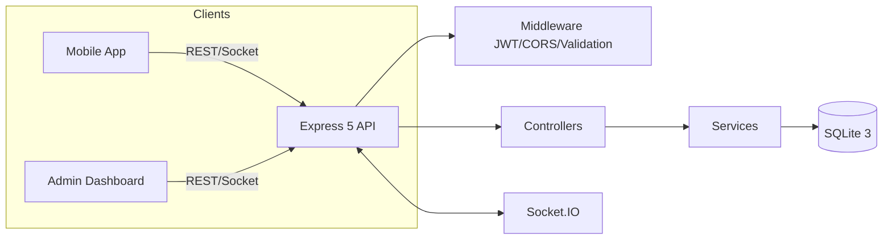

<div align="center">

# ⭐ STAR Challenge — Backend API

[](https://opensource.org/licenses/ISC)
[](http://makeapullrequest.com)


<sub>Plateforme API sécurisée pour piloter des défis de performance, la gamification et l’analytics en entreprise.</sub>

</div>

## 🚀 À propos

Backend Node.js/Express modulaire et robuste pour STAR Challenge. Il expose des API REST sécurisées, des mises à jour temps réel via Socket.IO, un calcul de classements/étoiles, et une couche analytics pour alimenter un dashboard administrateur et une application mobile.

Mots-clés: REST API, Node.js, Express 5, SQLite, JWT, Socket.IO, leaderboard, gamification, analytics, monitoring, logging, CORS, express-validator, bcrypt.

## 🧭 Sommaire

- Fonctionnalités clés
- Architecture & stack
- Dépôts liés
- Démarrage rapide
- Configuration (.env)
- Base de données & initialisation
- Endpoints principaux
- Temps réel (Socket.IO)
- Sécurité & conformité
- Journalisation (logs)
- Scripts npm
- Contribution & licence

## 🌟 Fonctionnalités clés

- 🔐 Authentification JWT, rôles et protection des routes.
- 🏆 Gestion des challenges, critères, participants, performances, gagnants, paliers et récompenses.
- 📊 Analytics administrateur (aperçu, challenges, performances, récompenses).
- ⚡ Temps réel: actualisation des classements et statistiques avec Socket.IO (rooms par challenge).
- ✅ Validation des entrées (express-validator) et gestion d’erreurs centralisée.
- 🧱 Persistance SQLite, requêtes optimisées et schéma relationnel clair.
- 📈 Journalisation structurée via Winston (fichiers combined/error).

## 🧱 Architecture & stack



Pile technique: Node.js 16+, Express 5, SQLite3, Socket.IO 4, JWT, bcrypt, express-validator, Winston.

Structure du projet:

```
config/        # DB & JWT
controllers/   # Contrôleurs REST + error handler
database/      # Schema + init script
middleware/    # Auth JWT, etc.
models/        # Accès SQLite par entité
routes/        # Définition des endpoints
services/      # Business logic (score, classement, récompenses)
utils/         # Logger Winston
```

## 🔗 Dépôts liés

- Admin Dashboard: [github.com/fekikarim/starChallenge_dashboard](https://github.com/fekikarim/starChallenge_dashboard)
- Frontend mobile (Flutter): [github.com/fekikarim/star_frontend](https://github.com/fekikarim/star_frontend)

## ⚙️ Démarrage rapide

Prérequis: Node.js 16+, npm 8+, SQLite3 installé.

1) Installer les dépendances

```bash
npm install
```

2) Configuration environnement

```bash
cp .env.example .env
# Éditer .env et renseigner vos valeurs
```

3) Initialiser la base de données

```bash
npm run init-db
```

4) Lancer le serveur

```bash
npm start
```

API disponible sur <http://localhost:3000>

## � Configuration (.env)

Variables supportées:

- PORT (optionnel, défaut: 3000)
- JWT_SECRET (requis)
- NODE_ENV (development | production)

Voir `.env.example` pour un modèle prêt à l’emploi.

## 🗄️ Base de données & initialisation

- SGBD: SQLite (`database/starchallenge.db`)
- Schéma: voir `database/schema.sql`
- Initialisation: `npm run init-db` (exécute `database/init-db.js`)

Tables principales: Utilisateur, Challenge, Critere, Participant, Performance, Gagnant, Etoile, Palier, Recompense.

## 🔌 Endpoints principaux (aperçu)

Consultez la documentation complète: `API_GUIDE.md`.

- Authentification & Utilisateurs
   - POST `/api/utilisateurs/login` — connexion et génération de JWT
   - CRUD `/api/utilisateurs` (protégé)
   - GET `/api/utilisateurs/check-email` — vérification de disponibilité email

- Challenges & Classements
   - GET `/api/challenges` — liste des challenges (incl. `/app/list` pour mobile)
   - POST `/api/challenges` — création (protégé)
   - GET `/api/challenges/:id/classement` — classement d’un challenge
   - GET `/api/challenges/:id/gagnants` — détermination/récupération des gagnants

- Participants & Performances
   - CRUD `/api/participants` (+ `global-leaderboard`, `user/:userId`, `user/:userId/status/:status`)
   - CRUD `/api/performances`

- Étoiles, Paliers, Récompenses
   - CRUD `/api/etoiles`, `/api/paliers`, `/api/recompenses`

- Analytics & Leaderboard
   - Admin-only: `/api/stats/overview`, `/api/stats/challenges`, `/api/stats/performances`, `/api/stats/recompenses`
   - Leaderboard: `/api/leaderboard/global`, `/weekly`, `/monthly`, `/position/:userId`
   - Temps réel: `/api/classement/:challengeId` et `/stats`

## ⚡ Temps réel (Socket.IO)

Événements émis/écoutés:

- Client → serveur: `subscribe_challenge`, `unsubscribe_challenge`, `request_leaderboard`, `request_stats`, `ping`
- Serveur → client: `leaderboard_update`, `stats_update`, `performance_change`, `pong`, `subscription_confirmed`

Chaque challenge possède sa “room” (`challenge_{id}`) pour des diffusions ciblées.

## �️ Sécurité & conformité

- JWT (Authorization: Bearer <token>) via `middleware/authMiddleware.js`
- Rôles (ex. admin) pour l’accès aux stats
- Bcrypt pour le hachage des mots de passe
- Validation systématique des payloads avec `express-validator`
- CORS configuré pour les clients front (React/Flutter)

## � Journalisation

- Winston configuré en JSON avec timestamp
- Fichiers: `logs/combined.log` et `logs/error.log`
- En dev, sortie console colorisée

## 📜 Scripts npm

```json
{
   "init-db": "node database/init-db.js",
   "start": "node index.js"
}
```

## 🤝 Contribution

Les contributions sont bienvenues. Ouvrez une issue, proposez une PR, pensez à des commits atomiques et testables.

## 📄 Licence

ISC. Voir [LICENSE](./LICENSE).

## � Auteurs

- Karim Feki — [GitHub](https://github.com/fekikarim) · [Email](mailto:feki.karim28@gmail.com) · [LinkedIn](https://www.linkedin.com/in/karimfeki/)
- Nesrine Derouiche — [GitHub](https://github.com/nesrine77) · [Email](mailto:nesrine.derouiche15@gmail.com) · [LinkedIn](https://www.linkedin.com/in/nesrine-derouiche/)

—

<div align="center">
   <sub>Fait avec ❤️ pour la performance d’équipe.</sub>
</div>
